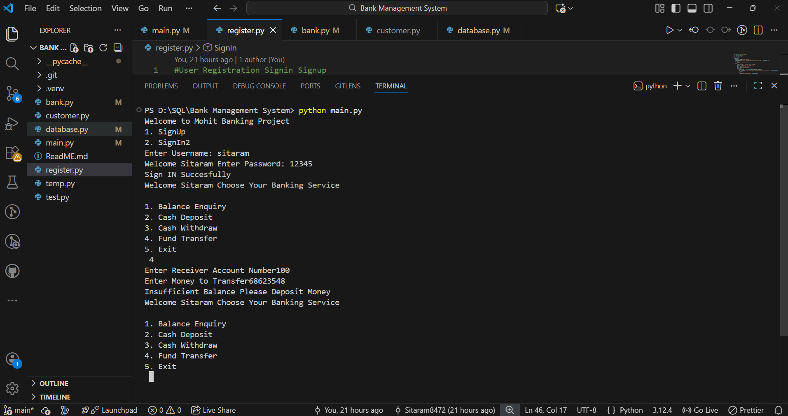

# 🏦 Bank Management System

A robust Python-based command-line interface (CLI) application designed to manage banking operations efficiently. This system leverages MySQL for data persistence and follows Object-Oriented Programming (OOP) principles to ensure scalability and clean code.

---

## ✨ Features

### 🔐 Authentication System
* **Sign Up:** Register new users with unique account numbers.
* **Sign In:** Secure login for existing users to access their accounts.

### 👤 Account Management
* **Profile Updates:** Modify account details easily.
* **Balance Enquiry:** Real-time check of available funds.
* **Transaction History:** View a detailed log of all past activities with date and time stamps.

### 💰 Transactions & Facilities
* **Credit/Withdraw:** Add or remove funds from your account.
* **Funds Transfer:** Securely send money to another user's account.
* **Unique Identification:** Every user is assigned a separate, unique account number.
* **Automated Tracking:** Transactions are automatically logged using Python's date/time functions.

---

## 🛠️ Tech Stack

* **Language:** Python 3.x
* **Database:** MySQL
* **Paradigm:** Object-Oriented Programming (OOP)
* **Library:** `mysql-connector-python`

---

## 🚀 Getting Started

### 📌 Prerequisites
1.  **Python:** Download and install from [python.org](https://www.python.org/).
2.  **MySQL:** Ensure you have MySQL Server installed and running.

### ⚙️ Installation

1. **Install MySQL Connector:**
   ```bash
   pip install mysql-connector-python

   ## ⚙️ Installation & Setup

To get a local copy up and running, follow these simple steps:

### 1️⃣ Clone the Repository

git clone [https://github.com/Sitaram8472/Bank-Management-System]

## Navigate to the Project Directory
* cd Bank-Management-System

## 📋 Detailed Functionalities

* The system is built with a focus on data integrity and user experience. Below is a breakdown of the core modules:

## Features

### 1. Registration
- Captures user personal details during sign-up.
- Initializes a new account with a **unique account ID**.
- Stores user information securely in a **MySQL database**.

### 2. Transactions
- Supports **deposits** and **withdrawals** with proper validation.
- Enables **secure inter-account fund transfers**.
- Prevents invalid operations such as insufficient balance or invalid account IDs.

### 3. Object-Oriented Design
- Implemented using **Object-Oriented Programming (OOP)** principles.
- Uses well-defined **classes and objects** for better modularity.
- Ensures clean, maintainable, and scalable code architecture.

### 4. Data Persistence
- All user accounts are stored persistently in **MySQL tables**.
- Transaction history is saved reliably to avoid data loss.
- Ensures consistency between application state and database records.

### 5. Logging & Auditing
- Automatically logs every transaction.
- Records **exact date and time** for each operation.
- Helps with auditing, debugging, and security tracking.


## Project Preview



